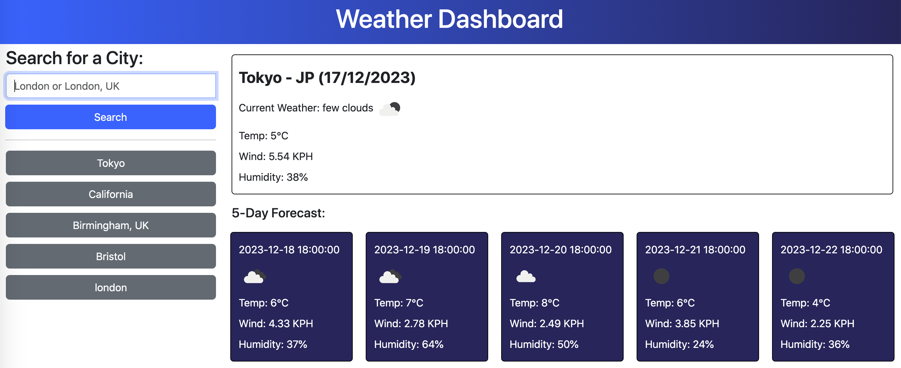

# weather-dashboard

## Description 
An application was developed to serve as a weather dashboard, enabling users to obtain weather forecast information for either individual cities or multiple locations. This app is designed to operate seamlessly within a web browser, incorporating dynamically updated HTML and CSS elements for an enhanced user experience.

The URL of the deployed application: https://itismliu.github.io/weather-dashboard/

The URL of the GitHub repository: https://github.com/ItIsMLiu/weather-dashboard

Screenshot of webpage:

A set of initial code files, as depicted in the second commit, was given, featuring HTML and CSS files. The project then underwent further development, incorporating my recently acquired expertise in JavaScript and server APIs. Below, I outline how these skills were seamlessly integrated into the project:

- Accessing Server APIs data and functionality by issuing requests with specific parameters to a designated URL.
- Retrieving data from an external application's API and incorporating it into the creation of another application.
- Implementing the use of localStorage to store persistent data efficiently.

## Installation

N/A

## Usage 

To initiate the website experience, please follow the provided URL link. Upon accessing the top-left input field, users can search for a city, leading to the display of current and upcoming conditions for the selected city, which is then added to the search history. When viewing the current weather conditions, users will encounter details such as the city name, date, a visual representation of weather conditions, temperature, humidity, and wind speed. For future weather conditions, a 5-day forecast is presented, showcasing the date, icon, temperature, and humidity. Clicking on a city within the search history retrieves and displays both current and future conditions for that specific city.

## Credits

Other resources used as guides:
- Using weather icons: https://openweathermap.org/weather-conditions
- Using weather icons: https://stackoverflow.com/questions/44177417/how-to-display-openweathermap-weather-icon

## License

MIT license (Please refer to the LICENSE in the repository).